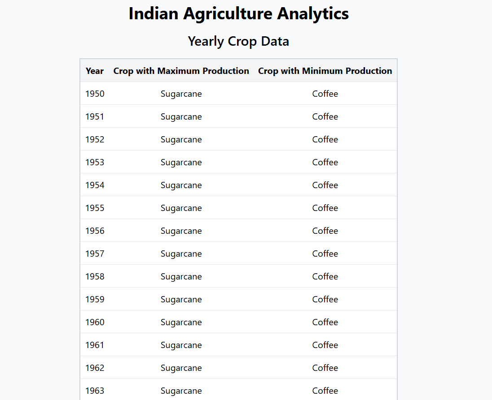
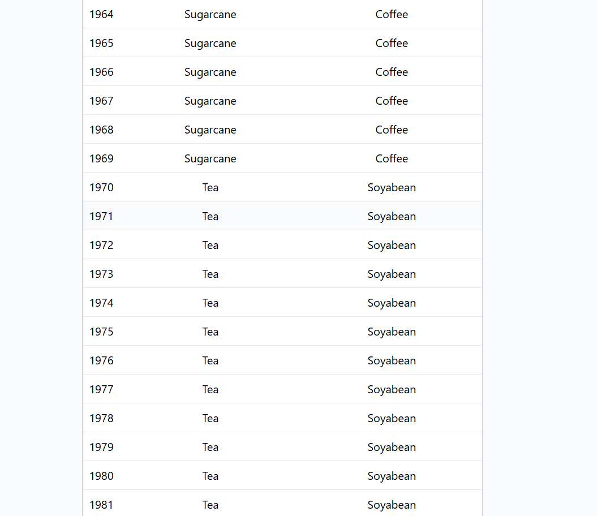
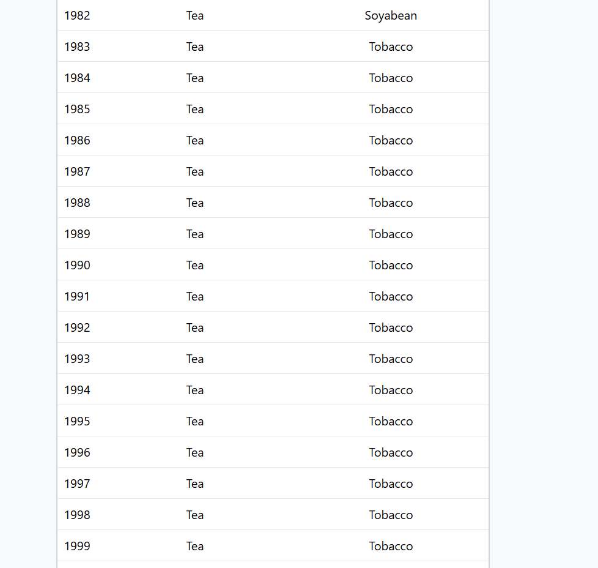
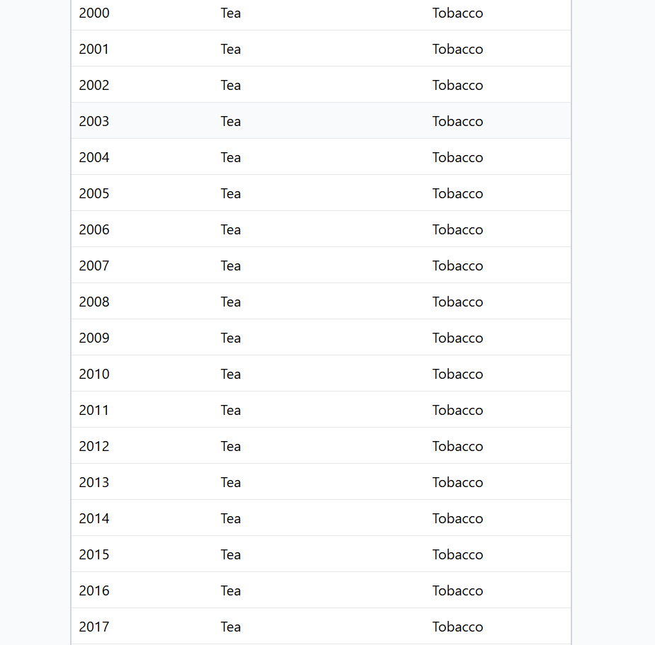
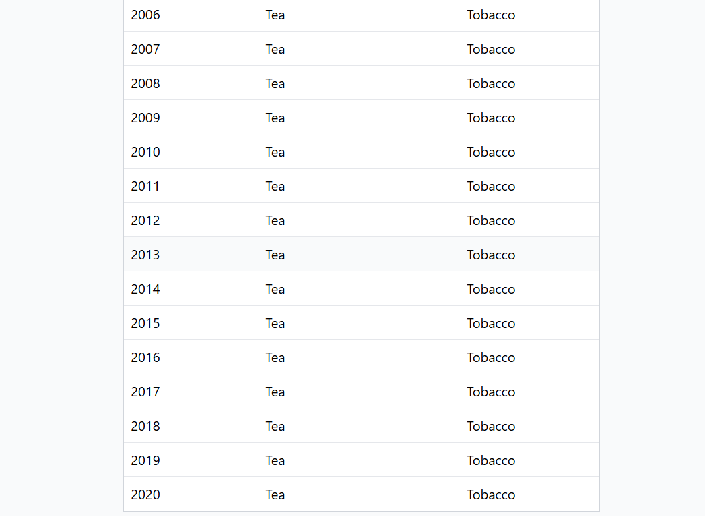
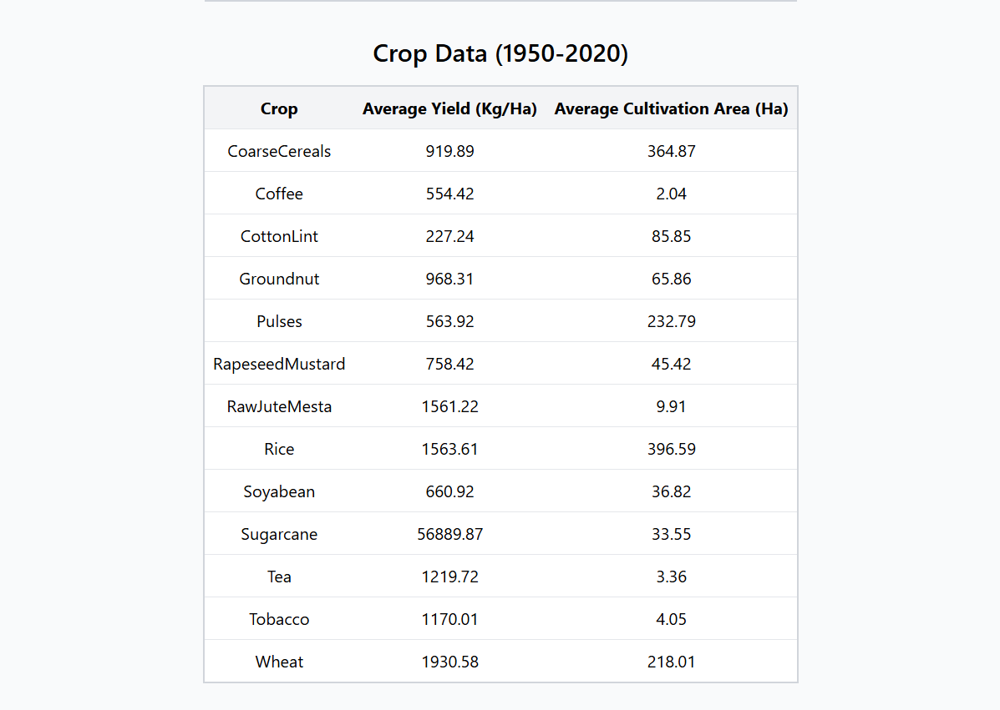

# Agriculture Data Analytics
This project provides a web application for analyzing agriculture data, specifically focusing on crop production and yield statistics over the years. The application is built with React, TypeScript, and Vite, utilizing Tailwind CSS for styling and Mantine for table components.

# Features
### Yearly Data Analysis: 
Displays the crop with the maximum and minimum production for each year.
### Crop Data Aggregation: 
Shows average yield and cultivation area for each crop between 1950 and 2020.
### Responsive Design: 
Utilizes Tailwind CSS for a responsive and visually appealing user interface.
### Data Visualization:
 Presents data in clear, organized tables using Mantine's Table component.
Technologies Used
### React: 
Frontend library for building the user interface.
TypeScript: Provides static type checking and improved developer experience.
### Vite: 
Build tool for faster development and optimized production builds.
### Tailwind CSS: 
Utility-first CSS framework for styling.
### Mantine: 
React component library for UI components.


## Screenshots









## Setup Instructions
### Prerequisites
Ensure you have Node.js and npm installed on your machine. You can download and install them from Node.js official website.

## Installation
## Clone the Repository

### git clone 
Link:- [https://github.com/nikhil0223/Agriculture.git](https://github.com/nikhil0223/Agriculture.git)

Code cd agriculture-data-analytics

### Install Dependencies
```
npm install
```
### Setup Tailwind CSS

Follow the [official Tailwind CSS installation guide](https://tailwindcss.com/docs/guides/vite) to ensure Tailwind is correctly set up.

### Run the Development Server
```
npm run dev
```
The application will start, and you can view it in your browser at `http://localhost:5173/`.

Project Structure

### src/:
Contains the main source code for the project.
### components/: 
React components for displaying data tables.
### CropDataTable.tsx: 
Component for displaying crop aggregation data.
### YearlyDataTable.tsx: 
Component for displaying yearly crop production data.
### types/: 
TypeScript types for data models.
### data.ts: 
Type definitions for data structures used in the project.
### utils/: 
Utility functions for data processing.
### dataUtils.ts: 
Functions for fetching and aggregating data.
### App.tsx: 
Main application component.
### public/: 
Static files and assets.

### index.css: 
Tailwind CSS styles.

### vite.config.ts: 
Vite configuration file.

## Data Source
The data used in this project comes from the Indian Agriculture dataset provided by the National Data and Analytics Platform (NITI Aayog). Ensure that the JSON file is available in the public/data/ directory as data.json.

## License
This project is licensed under the MIT License. See the LICENSE file for details.

## Contact
For any questions or issues, please contact nikhilsharma00623@gmail.com.
